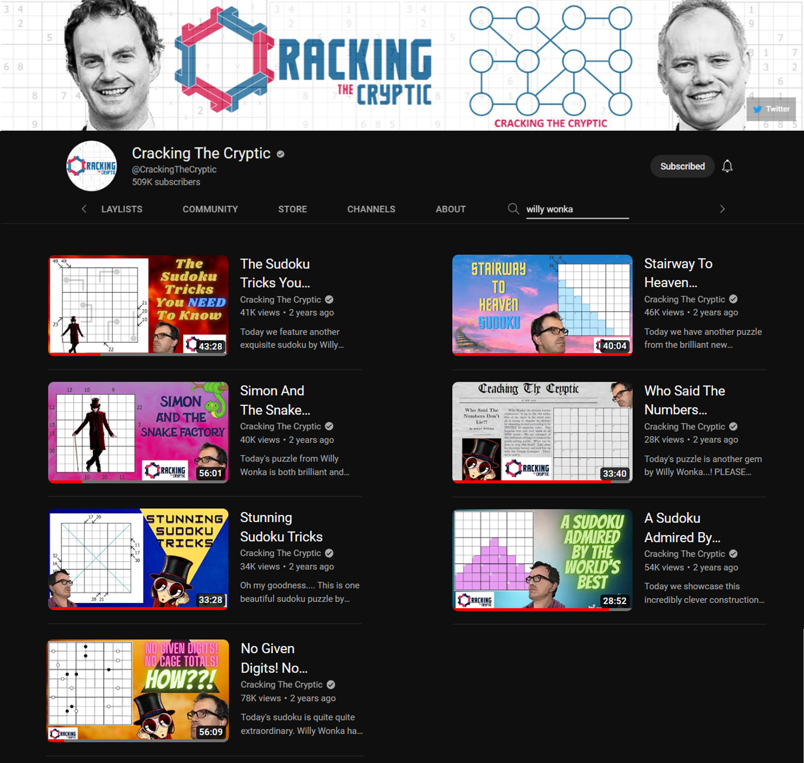

# About Me

I am Wil Vanderstaay, a Monash University graduate for a Bachelor of Software Engineering degree with a computer science minor. I am currently looking for work in this field to put my skills to practice and begin my career in software development. This repository provides details of my achievements and university and personal projects with source code provided when it is mine to share. I can be contacted at wilvanderstaay@gmail.com. 

Any spare time I have, I volunteer at a local charity [Free 3D Hands](https://free3dhands.org/), to help them print and assemble hands for people in need all around the world. I also work casually as a supervisor at a large fish and chip shop, where I am in charge of the daily operations and coordination of staff to ensure the business runs effectively and efficiently.

# My Projects

### [Chess Engine and GUI](https://github.com/wil-vanderstaay/chess_engine_gui)

I have created a chess AI using Javascript which can challenge most skilled players. I have recently begun creating a mechanical chess board which uses a magnet to move the pieces of the opponent, with the dream of connecting it online and to my AI to allow games to be played on a physical board without the opponent present.

### AskPCOS Goal Setting Extension

The final year project of my degree was to extend the existing web application for a group at Monash Health, [AskPCOS](https://www.askpcos.org/). The app currently provides information for women with polycystic ovary syndrome (PCOS) and our goal was to incorporate a goal setting process to help the women identify and manage their goals. This project provided me with the opportunity to work with many different groups of people to achieve our goal and follow the best software practices while doing so. The groups included the student development team (my team), a student design team, the developers of the existing application, our clients from Monash Health, a university supervisor and actual users of the app. We followed the human-centred design process which meant we interacted directly with end users to perform usability studies and identify improvements that could be made to our extension. 

# My Achievements

### Sudoku Constructor

During lockdown in 2020, I became obsessed with a popular Youtube channel [Cracking the Cryptic](https://www.youtube.com/c/CrackingTheCryptic) (CtC) which is dedicated to solving sudokus, often with unusual extra rules. I was inspired to attempt to create my own sudokus under the psuedonym "Willy Wonka", and eventually became renowned enough to be featured on their channel, receiving tens of thousands of views. They later released a book containing their greatest hits which included one of my featured puzzles and a puzzle which I made specifically for the book.

A video of Simon from CtC solving my favourite puzzle I constructed can be found [here.](https://www.youtube.com/watch?v=FAhVKjr5GLg)

    
    

